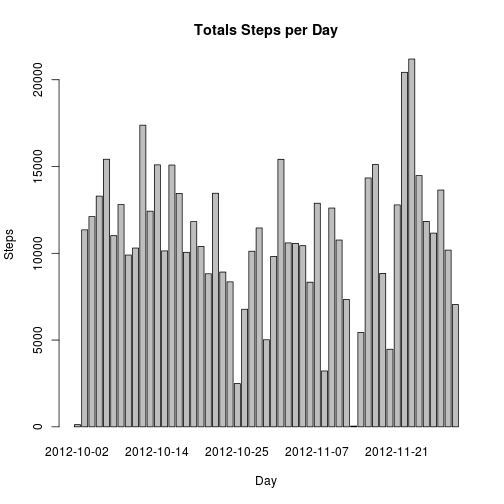
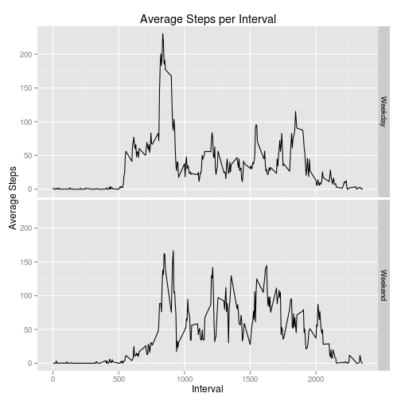

## Loading and preprocessing the data

The following is the code used to read the data, transform the date column and remove observations missing step values.


```r
library("dplyr")
library("knitr")

# load and remove NA cases
df <- read.csv(unz("activity.zip", "activity.csv"))
df$date <- as.Date(df$date)
df_clean <- na.omit(df)
```

## What is mean total number of steps taken per day?


```r
#total number of steps taken per day
df_clean$date <- as.factor(df_clean$date)

steps_by_date <- df_clean %>%
  group_by(date) %>%
  summarise(total = sum(steps))

mean_step_per_day <- format(round(mean(steps_by_date$total)))
median_step_per_day <- median(steps_by_date$total)
```

The **mean** and **median** total number of steps takes per day were **10766** and 
**10765** respectively.


```r
barplot(steps_by_date$total, 
        names.arg = steps_by_date$date, 
        main = "Totals Steps per Day",
        xlab = "Day",
        ylab = "Steps")
```

 

## What is the average daily activity pattern?


```r
steps_by_interval <- df_clean %>%
  group_by(interval) %>%
  summarise(average = mean(steps))

max_average_steps_interval <- steps_by_interval[which.max(steps_by_interval$average), ]$interval
```

Interval **835** had the highest average total steps over all the days.


```r
plot(steps_by_interval$interval, 
     steps_by_interval$average, 
     type = "l", 
     main = "Average Steps per Interval", 
     xlab = "Interval", 
     ylab = "Average Steps")
```

 

## Imputing missing values


```r
num_of_nas <- sum(is.na(df$steps))
df_imputed <- df

# loop over dataframe and replace NA with interval average
for (i in 1:nrow(df_imputed)) {
    if (is.na(df_imputed[i, "steps"])) {
      df_imputed[i, "steps"] <- steps_by_interval[steps_by_interval$interval == df_imputed[i, "interval"], ]$average
    }
}

steps_by_date_imputed <- df_imputed %>%
  group_by(date) %>%
  summarise(total = sum(steps))

mean_step_per_day_imputed <- format(round(mean(steps_by_date_imputed$total)))
median_step_per_day_imputed <- format(round(median(steps_by_date_imputed$total)))
```

The data set contained 2304 missing step values (e.g. NAs). For observations that had missing step values, 
the average number of steps over all days for the associated interval was substituted. Using this modified data set, the 
**mean** and **median** total number of steps takes per day were **10766** and 
**10766** respectively. These values are the close to the data with missing values, because we replaced
them with the average for that interval.


```r
barplot(steps_by_date_imputed$total,
        names.arg = steps_by_date_imputed$date, 
        main = "Totals Steps per Day with Missing Values Replaced",
        xlab = "Day",
        ylab = "Steps")
```

 

## Are there differences in activity patterns between weekdays and weekends?

Below is a plot of the average totals steps per interval over all the days, separated by weekday and weekend. There is 
some difference in the activity. On weekends, the steps are slightly higher in the morning. This could be due to people
sleeping later on the weekend. The peak intervals are at roughly the same time, however the weekday peak is over 100 
steps more than the weekend peak.


```r
# activity patterns between weekdays and weekends
weekday_weekend <- df_imputed
is_weekend <- (as.POSIXlt(weekday_weekend$date)$wday %in% c(0, 6))
weekday_weekend <- cbind(weekday_weekend, is_weekend)
weekday_weekend$is_weekend <- ifelse(weekday_weekend$is_weekend, "Weekend", "Weekday")
weekday_weekend$is_weekend <- as.factor(weekday_weekend$is_weekend)

steps_by_interval_imputed <- weekday_weekend %>%
  group_by(interval, is_weekend) %>%
  summarise(average = mean(steps))

library(ggplot2)
qplot(interval,
      average,
      data = steps_by_interval_imputed,
      geom = "line",
      facets = is_weekend ~ .,
      main = "Average Steps per Interval",
      xlab = "Interval",
      ylab = "Average Steps")   
```

 
